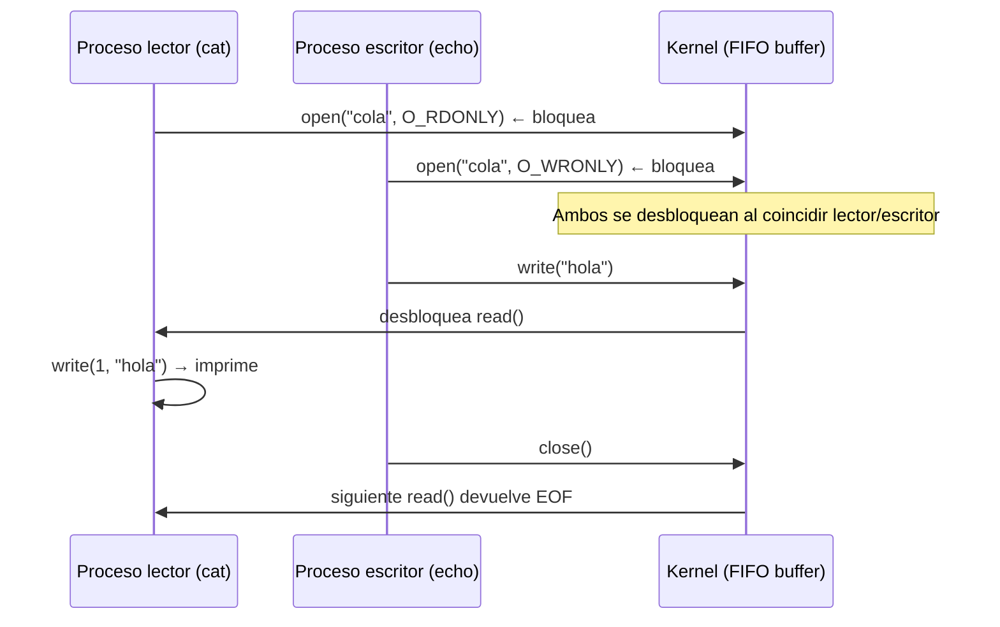
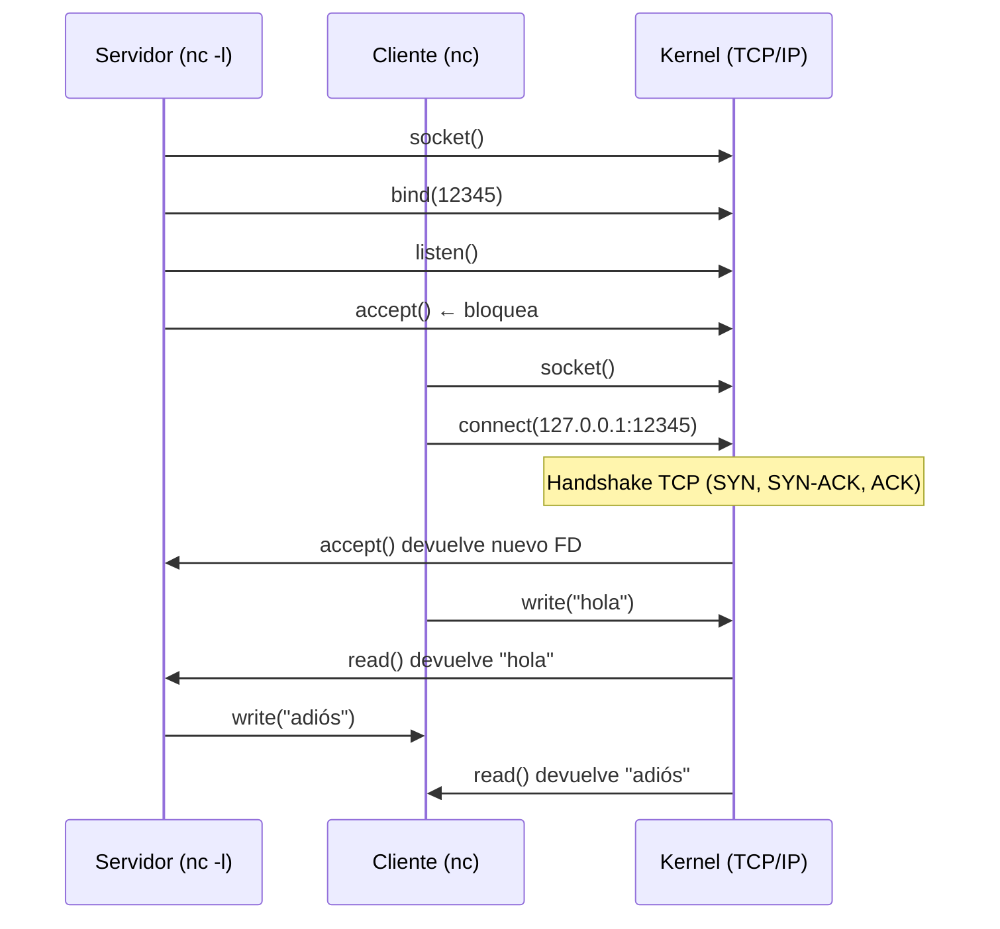

# 📘 Apuntes Bloque 6: Tuberías con nombre y Sockets

## 🔹 Tuberías (Pipes y FIFOs)

- **Pipe anónima:** creada con `|` o `pipe()`. Solo funciona entre procesos emparentados (padre-hijo).
- **FIFO (named pipe):** archivo especial en el sistema de ficheros que permite comunicación entre procesos no relacionados.

Características:
- Comunicación **unidireccional**.
- Implementada como un **buffer circular en memoria** gestionado por el kernel.
- Bloqueo automático:
  - `read()` bloquea si no hay datos.
  - `write()` bloquea si no hay lectores, y genera `SIGPIPE` si se intenta escribir.

### Creación y uso
```bash
mkfifo cola
cat < cola          # lector bloqueado
echo "hola" > cola  # escritor desbloquea al lector
```

### Syscalls principales
- `mknod("cola", S_IFIFO)`
- `open("cola", O_RDONLY / O_WRONLY)`
- `read()`, `write()`
- `close()`

### Flujo típico FIFO



---

## 🔹 Sockets

- Mecanismo IPC más general que pipes.
- Comunicación **bidireccional**.
- Pueden ser:
  - **Locales:** `AF_UNIX`
  - **Red (TCP/IP):** `AF_INET`, `AF_INET6`

Características:
- Cada socket es un **file descriptor**.
- El kernel mantiene dos buffers: **send** y **recv**.
- Soportan **múltiples clientes** mediante `accept()`.

### Ejemplo con `nc` (netcat)

**Servidor:**
```bash
nc -l -p 12345
```

**Cliente:**
```bash
nc localhost 12345
```

### Syscalls principales

Servidor:
- `socket(AF_INET, SOCK_STREAM, 0)`
- `bind()`
- `listen()`
- `accept()`
- `read()`, `write()`

Cliente:
- `socket(AF_INET, SOCK_STREAM, 0)`
- `connect()`
- `read()`, `write()`

### Flujo típico Socket TCP



---

## 🔹 Comparativa FIFO vs Socket

| Aspecto             | FIFO (mkfifo)                        | Socket (nc / API)                      |
|---------------------|--------------------------------------|----------------------------------------|
| Dirección           | Unidireccional                       | Bidireccional                          |
| Alcance             | Solo local (sistema de ficheros)     | Local (`AF_UNIX`) o red (`AF_INET`)    |
| Persistencia        | Archivo especial en FS               | No hay archivo (solo puerto/socket)    |
| Multiplicidad       | 1 escritor ↔ 1 lector (no broadcast) | Varios clientes con `accept()`         |
| Buffers             | Uno compartido                       | Dos buffers (send/recv)                |

---

## 🔹 Analogía

- **FIFO:** un tubo de plástico → lo que entra por un extremo sale por el otro, en orden FIFO.
- **Socket:** un teléfono → puedes hablar y escuchar a la vez, y tener muchos conectados a la centralita.

---
